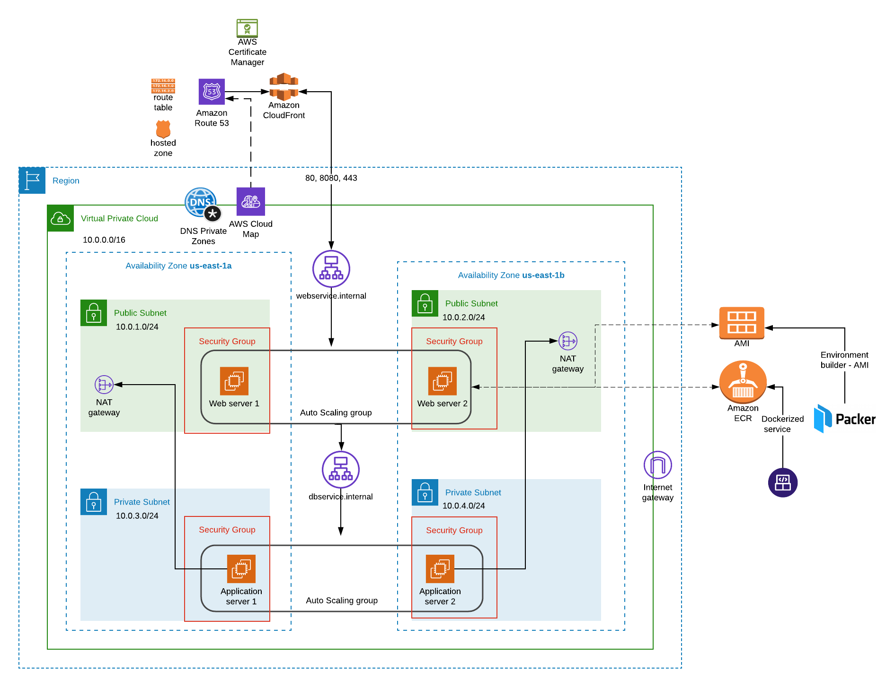

.. work in progress ..

An overview is below. 

## Get started
1. Build a service or app and dockerize it
2. Use packer infra to build environment supporting the docker container. 
3. Use the AMI from #2 in the infra-structure after setting right variables in variables.tf
4. Pre-provision a domain and ssl certificate in the aws environment. 

The example helps with .. 
- a single service on front end side with auto scale properties on CPU load. 
- packer build process to create a desired image for autoscale group to pick up
- a sample rust project to act as a service.
- [todo] a sample rust project to act as a db app utility.